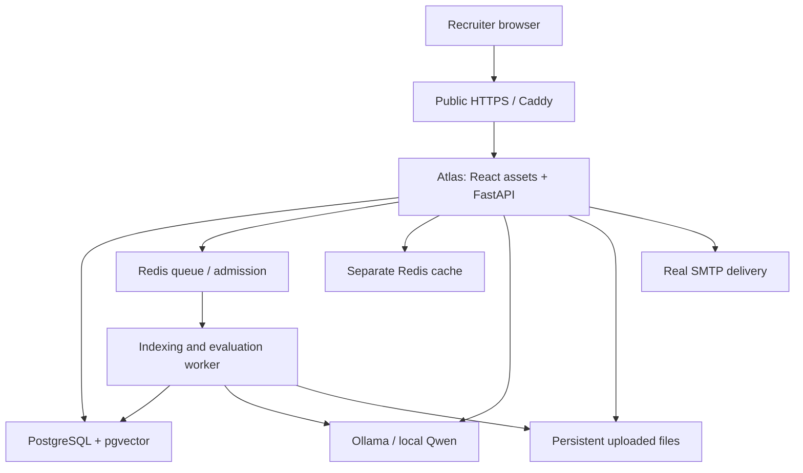

# Atlas deployment and resume demo

Updated 18 September 2026. **Source published; static project showcase deployed. The interactive application is not publicly hosted yet.** Approved budget: **₹0**. Repository: [shivam0870/atlas](https://github.com/shivam0870/atlas). Showcase: [shivam0870.github.io/atlas](https://shivam0870.github.io/atlas/). No custom domain or paid resources were purchased.

## Recommended ₹0 setup

| Part | Choice | Availability |
|---|---|---|
| Source and verification evidence | The supplied public GitHub repository | Published on `main` |
| Resume showcase | GitHub Pages with screenshots, architecture and honest test results | Deployed at `https://shivam0870.github.io/atlas/`, independently of the Mac |
| Full frontend and backend | Existing native Atlas runtime on the Mac, behind an ngrok free HTTPS endpoint | Requires the Mac awake, online and running Atlas and the tunnel |
| Database, worker and local AI | A dedicated demo database/uploads and native local inference | No rented server or paid model API; existing computer, electricity and internet still required |
| Email | Dedicated personal Gmail account, SMTP STARTTLS and an app password | Low-volume demo use; subject to account eligibility, sending limits and actual delivery verification |

This is a recommendation pending confirmation that an online Mac is acceptable for live demos. It is not a claim that the complete application has free always-on cloud hosting. GitHub Pages serves the project showcase; it cannot run the Python API, database, background worker or model. [GitHub Pages availability](https://docs.github.com/en/pages/getting-started-with-github-pages).

The ngrok free plan includes a provider-assigned HTTPS development domain, 1 GB outbound transfer and 20,000 HTTP requests per month. Browser visitors see an initial ngrok warning page. These limits suit occasional supervised demos and must be checked against actual traffic. Streaming answers still need testing through the chosen endpoint. [Official free-plan limits](https://ngrok.com/docs/pricing-limits/free-plan-limits).

### Account setup needed from the owner

1. **GitHub authentication completed.** The reviewed source and showcase were published after checking the current file set and all five prior commits against the secret-scanning baseline. Private configuration, models, database backups and local inbox data were excluded. Future authentication uses `gh auth login --hostname github.com --git-protocol https --web`; do not paste tokens into chat.
2. If the Mac-based demo is acceptable, create a **free** [ngrok account](https://dashboard.ngrok.com/signup). Configure its authtoken privately through its documented setup, then share only the assigned public hostname. Account creation alone does not expose the Mac; start the endpoint only after the dedicated demo instance is ready.
3. Create or choose a dedicated personal Gmail sender. Enable 2-Step Verification and create an Atlas-specific [Google app password](https://myaccount.google.com/apppasswords). Keep it in local private configuration, never in Git or chat. App passwords may be unavailable for some managed accounts or accounts with Advanced Protection. [Google requirements](https://support.google.com/accounts/answer/185833?hl=en).

SMTP settings for the dedicated demo configuration are `SMTP_HOST=smtp.gmail.com`, `SMTP_PORT=587`, `SMTP_STARTTLS=true`, with `SMTP_USERNAME` and `SMTP_FROM` set to the dedicated sender and `SMTP_PASSWORD` set to its app password. Atlas already supports these fields. Do not change the running development `.env` or publish its Mailpit inbox as a substitute for real delivery. [Google SMTP settings](https://support.google.com/mail/answer/7104828?hl=en).

### Remaining work before a public demo

- **Completed:** publish reviewed source and a static showcase. Pages deployment [35369073606](https://github.com/shivam0870/atlas/actions/runs/35369073606) succeeded; public HTTPS returned 200. Chrome checks of the deployed page at 1440px and 390px passed for the screenshot, layout, keyboard skip link, section navigation and disclosure controls, with no page errors. Backend CI runs separately from static publication.
- **Completed:** [GitHub CI 35369073611](https://github.com/shivam0870/atlas/actions/runs/35369073611) passed on product commit `86e87d6`: 89 backend tests, 16 frontend tests, 3 real account/onboarding browser journeys, migrations, static checks and frontend build. One local-model test was deselected; the complete seven-journey local suite and inference evidence remain separate. The human-reviewed corpus gate remains pending.
- Provision isolated demo data and original-file storage; keep private local data, database ports and the development inbox inaccessible from the tunnel.
- Set the dedicated instance's `APP_URL` to its actual HTTPS origin before testing cookies and email links.
- Verify actual SMTP delivery, signup/reset, streamed answers, citations and follow-ups through the public hostname from another network.
- Record startup/shutdown and recovery instructions for the dedicated instance. Existing Docker server files below are an alternative for future server capacity, not the selected ₹0 Mac setup.

## Recommended architecture

Deploy the existing React frontend and FastAPI backend behind **one HTTPS address**. Atlas already serves `web/dist`; it does not need a separate frontend hosting service. Keep the frontend, `/api` and `/mcp` on the same origin to preserve the current cookie/session and CSRF design. Splitting providers is possible through an appropriate same-origin proxy, but is extra work for this release.



### What is needed

| Item | Why / decision |
|---|---|
| GitHub repository | Source and evidence link for the resume; this checkout currently has no Git remote |
| Linux server or existing host | Runs the API, worker, database, Redis and local inference continuously |
| Initial sizing | **Planning estimate: 4–8 vCPU, 16 GiB RAM, at least 80 GB SSD**, one generation at a time; benchmark on the actual host before promising latency/capacity |
| Domain or subdomain | Stable HTTPS URL and account email links; Caddy terminates TLS |
| SMTP provider and verified sender | Public users need verification/reset/invitation emails; local Mailpit is for development |
| Persistent storage | Database, queue, original uploads, model files and TLS state survive restarts |
| Backups | Database + uploads + matching MFA encryption key, stored privately off the server |
| Synthetic demo corpus | A useful initial company with documents and service inventory; avoid publishing local personal data/test inboxes |

Paid model API usage remains disabled. **Zero model API cost does not mean zero hosting cost.** A rented server, domain, backups and SMTP may have costs. No paid resources should be created until the actual quote and budget are agreed.

## Hosting choices

1. **Always-on full app:** use one sufficiently provisioned server for a small resume demo. This avoids separate database/worker/inference subscriptions. CPU generation needs a real latency test; GPU hosting is a later option if required.
2. **No hosting spend:** publish the source, screenshots and a recorded walkthrough on a public project page; demonstrate the native app during interviews. An optional tunnel can expose a dedicated demo instance while the computer is awake, but that is not a 24/7 deployment.
3. **Existing cloud credits/server:** use available capacity after checking RAM, persistent disk, SMTP egress and actual credit expiry/costs. Do not assume a free-tier machine can run Qwen plus the rest of Atlas.

Provider facts checked on 18 September 2026:

- Render free web services have limited compute and idle behavior; persistent disks require paid services. That does not cover Atlas's durable uploads and separate long-running worker for free. [Render disks](https://render.com/docs/disks), [Render free services](https://render.com/docs/free).
- Cloudflare **Quick Tunnels do not support SSE**, which Atlas uses to stream answers. Do not use a random `trycloudflare.com` Quick Tunnel for the complete demo. A configured Cloudflare Tunnel is a different option. [Cloudflare limitations](https://developers.cloudflare.com/cloudflare-one/networks/connectors/cloudflare-tunnel/do-more-with-tunnels/trycloudflare/).
- ngrok's free offering has request/transfer limits and a browser warning page. It is a candidate for supervised demonstrations, subject to an actual streamed-answer test. [ngrok limits](https://ngrok.com/docs/pricing-limits/free-plan-limits).
- Check current server pricing and availability at purchase time, including region, tax, IPv4 and backups. [Hetzner pricing adjustments](https://docs.hetzner.com/general/infrastructure-and-availability/price-adjustment/). No provider price or availability is promised here.

## Deployment files prepared

- [deploy/compose.yaml](deploy/compose.yaml): separate `atlas-public` project; only the HTTPS proxy publishes ports; API/worker share persistent originals; separate application/identity/worker credentials; migration-only administrative credentials; real SMTP settings; local models only.
- [deploy/Caddyfile](deploy/Caddyfile): one public origin with streaming-capable reverse proxy. Caddy handles SSE without ordinary response buffering. [Caddy documentation](https://caddyserver.com/docs/caddyfile/directives/reverse_proxy).
- [deploy/.env.example](deploy/.env.example): required private configuration. `deploy/.env` is ignored by Git and the root `.env` stays unchanged.

These files are a candidate for **a new dedicated demo server**, not an instruction to publish this laptop or point production at its development database. The earlier shared 2 GiB Colima VM did not complete container inference; see [release evidence](UPGRADE_RELEASE.md). Full public rollout must pass the checks below on the actual server.

### Preparation checks actually run

- Docker Compose resolved all 10 services using disposable synthetic configuration. Checked that only the proxy publishes ports, API and worker share the uploads volume, runtime processes do not receive migration credentials, and HTTPS/SMTP/zero paid budget settings are applied.
- Caddy 2.11.4 validated the actual Caddyfile in an isolated container with networking disabled and no published ports: **valid configuration**. This did not issue a public certificate or expose a service.
- Confirmed `deploy/.env` is Git-ignored and excluded from Docker build context; whitespace checks passed.
- Full server startup, public TLS/email, streamed cloud inference and cloud backup recovery have **not** run. Existing local backend/browser evidence is recorded separately in the release report.

### Before running on the chosen server

1. Select the provider/budget and give access through its normal authentication flow. Never paste passwords, private SSH keys or API tokens into chat.
2. Select a GitHub repository, public hostname, SMTP sender/provider and a small synthetic demo dataset. The deployment has no shared public owner password. Visitors can register and create personal workspaces; a seeded demo company can be accessed through scoped invitations for guided reviews.
3. Install Docker/Compose on the dedicated Linux host and build for its architecture. A locally built Apple Silicon image is not an amd64 server image.
4. Copy `deploy/.env.example` to private `deploy/.env` with mode 0600. Generate four independent hexadecimal database passwords and a Fernet key; preserve them. Fill in actual SMTP settings and the hostname. SMTP is STARTTLS, usually port 587. The hostname must match DNS and the HTTPS URL.
5. Point DNS at the server. Expose 80/443; restrict SSH. Keep database, Redis, model and administrative endpoints private. Do not publish Mailpit.

### Candidate launch commands

Run from the repository root **on the selected dedicated server**, after its configuration is complete:

```sh
docker build -t atlas:resume-20260918 .
docker compose --env-file deploy/.env -f deploy/compose.yaml config --quiet
docker compose --env-file deploy/.env -f deploy/compose.yaml up -d postgres redis cache ollama
docker compose --env-file deploy/.env -f deploy/compose.yaml run --rm migrate
docker compose --env-file deploy/.env -f deploy/compose.yaml run --rm models
docker compose --env-file deploy/.env -f deploy/compose.yaml run --rm model-pull
docker compose --env-file deploy/.env -f deploy/compose.yaml up -d api worker proxy
```

Use an immutable image digest for subsequent published releases. Pin downloaded model digests against the repository's model manifests before claiming reproducibility. Do not print resolved Compose configuration with real secrets; use `config --quiet`.

The production candidate intentionally disables telemetry export until a collector is configured. `/ready` checks database and queue connectivity; it does not prove inference works. Keep a separate actual-question smoke check and worker indexing check.

### Public acceptance checks

1. HTTPS and direct/deep links work from a different device/network.
2. Real email signup, verification, login, invitation and password reset work at the public URL; Secure cookies and CSRF checks work behind the proxy.
3. Upload PDF/DOCX → worker indexing → streamed question/answer → correct citation → follow-up → browser refresh works.
4. Two companies and a restricted space remain isolated; revoke a grant and verify old answers/saved items/source downloads become unavailable.
5. API/worker/server restart preserves users, MFA, uploads and conversation/version references.
6. Check disk/RAM usage, first-answer latency and behavior under the intended small demo concurrency. Tune quotas and admission before sharing a public registration link.
7. Verify backup restoration on the actual deployment layout before calling the hosted release ready.

The existing `scripts/backup.py` and `restore_backup.py` are deliberately bound to the **local** `atlas-rag-postgres-1` / port 55432 setup. They are not remote production backup scripts. A production backup procedure must use this Compose project's PostgreSQL service and named uploads volume, retain the matching private configuration, stop writers for a consistent release snapshot, and rehearse restoration into a separate target. Do not run `down -v` as an upgrade or rollback.

## Resume deliverables

You can describe the completed local engineering work now, while being accurate about deployment status. Add a public URL only after it passes the hosted checks.

**Suggested project title:** Atlas — Multi-tenant AI Knowledge Platform

**Suggested resume bullets:**

- Built a multi-tenant knowledge platform with React, FastAPI, PostgreSQL/pgvector and Redis, supporting role- and team-based access, private conversations and versioned PDF/DOCX ingestion.
- Implemented hybrid vector/BM25 retrieval, citation-backed local-model answers, agent/MCP tools and permission revalidation across caches, historical answers and source downloads, with no paid model API usage.
- Verified account/MFA security, tenant isolation and document-to-answer workflows with 90 backend tests, 16 frontend tests and 7 real browser journeys; rehearsed existing-data migrations and backup recovery.

Include a repository link, architecture diagram, screenshots, a short narrated demo, executed test results and clear setup instructions. Do not claim a human-reviewed accuracy percentage, production scale, Kubernetes deployment or completed public hosting until those are actually verified.

## Current handoff

The source and static resume showcase are public. The app is implemented and locally tested, with the container-inference limitation recorded above. **Interactive deployment is waiting on confirmation of Mac availability for live demos and tunnel/email account setup.** No custom-domain purchase is needed for the proposed free path. Publication has not changed the running local app, credentials or data.
