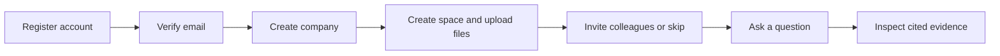

# Atlas product upgrade — proposal for approval

Date: 17 September 2026. Status: **approved for implementation by the user**. Execution and current verification are recorded in [UPGRADE_RELEASE.md](UPGRADE_RELEASE.md). The proposal below preserves the original scope and pre-upgrade findings.

This document is the scope for the next release. It is based on the current source code, existing desktop/mobile screenshots, and the recorded test report at commit `c191a71`. This planning review did not rerun the application or the old tests. No application code, database, credentials, or running services were changed.

## 1. Product direction

Build a private knowledge workspace that a person can actually adopt: create an account, create or join a company, invite colleagues, organize documents with the right permissions, ask follow-up questions, verify answers, and keep knowledge current.

Primary audience: engineering and operations teams. The strongest initial use cases are onboarding, finding operational procedures, answering service questions, and comparing structured service records with their supporting documents. Keep the terminology broad enough for another team to upload its own knowledge.

The defining demonstration will be: an owner registers a company, invites an editor and a viewer, the editor uploads a deployment guide into a restricted space, an authorized user gets a cited answer and a follow-up, an unauthorized user cannot discover the guide, and changing access also blocks old cached answers and conversation views.

### Selected defaults

- Keep FastAPI, PostgreSQL/pgvector, Redis, React/TypeScript, explicit hybrid retrieval, LangGraph, and local models.
- No paid model APIs or mandatory hosted identity subscription. External model API budget stays zero.
- Browser users authenticate as people. API keys become integration credentials, with explicit service identities and resource grants.
- A company is an existing tenant extended with ownership and membership; registration creates an application workspace, not legal company or domain verification.
- Email/password first, with optional authenticator-app MFA. Social login and enterprise SSO are later extensions.
- Development email goes to a local Mailpit inbox; an SMTP adapter supports later real delivery. Local email tests do not prove internet email delivery.
- Private-by-default conversation history. Company knowledge permissions and conversation ownership are separate.
- Major UI restructuring with an accessible design system, real URLs, and responsive layouts.
- Preserve existing documents, embeddings, evidence, and tenant IDs through tested migrations.
- This approval covers the included release below. Deferred features remain outside that scope. No publication, external invitations, cloud deployment, or paid services are implied.

## 2. Current gaps found in the implementation

| Area | Current evidence | Consequence / proposed correction |
|---|---|---|
| Identity | `Identity` contains tenant/key/scopes; no users or memberships | Add actual people and organization membership |
| Browser login | API key stored in an HttpOnly cookie; local workspace chooser | Replace ordinary user login with revocable user sessions; keep demo access explicit and separate |
| Organization lifecycle | Administrative CLI creates tenants | Add create/join/invite flows, role changes and ownership transfer |
| Internal permissions | Tenant isolation exists, but no team/document grants | Add resource authorization throughout retrieval, tools, caches and source endpoints |
| History | `/queries` returns workspace history to a read-scoped key | Make new conversations user-owned; retain legacy history in an admin-only archive |
| Library | TXT/Markdown uploads, one-document workflow, basic list filtering | Add useful spaces, text PDF/DOCX support, bulk ingestion and versions |
| Navigation | One large React entry file with page held in component state | Add route modules, deep links, browser history, shared typed components |
| Data fetching | Several endpoints reload every five seconds, regardless of page | Fetch by screen, paginate lists, and poll only active jobs |
| Visual hierarchy | Large decorative dashboard heading, developer metrics prominent | Put the question box, current work and onboarding first |
| Mobile evidence | Recorded screenshot has the navigation drawer covering much of the content | Explicitly test closed/open drawer states, backdrop, focus, scrolling and dismissal |
| Quality | Review machinery exists; corpus baseline is still pending | Improve review UX and feedback triage; retain human approval requirements |
| Deployment | Native E2E passed previously; complete container inference timed out | Include resource-aware packaging and a new honest acceptance report |

The old 35 backend and 5 browser tests establish a baseline for that build; they are not evidence for any feature in this proposal.

## 3. Complete proposed release feature list

Everything F01–F14 is included in the recommended approval scope. The staging order appears in section 10.

### F01 — Personal account registration and login

- Signup with name, email and password; clear validation and password-manager support.
- Email verification, resend with cooldown, expired-link recovery, and safe duplicate-registration behavior.
- Login, logout, password change, forgot/reset password, and verified email change.
- Single-use, expiring verification/recovery tokens; generic public recovery responses to reduce account enumeration.
- Profile settings with display name, initials avatar and theme preference.
- Explicit states for unverified, disabled, expired-session and invalid-link cases; preserve safe intended destinations after login.

### F02 — Sessions and account security

- Opaque server-side user sessions with random cookie tokens; store token hashes, not reusable session secrets, in the database.
- HttpOnly cookies, production HTTPS/Secure enforcement, CSRF protection, session rotation, idle/absolute expiry, and authentication throttling.
- Active-session list, revoke another session, and sign out everywhere. Password reset revokes existing sessions.
- Optional TOTP authenticator-app MFA with encrypted enrollment secrets, hashed one-use recovery codes, replay checks, and reauthentication for disable/reset.
- Reauthentication before ownership transfer, account deletion, MFA changes and other high-impact security actions.
- No browser API keys, passwords, or auth tokens in localStorage, analytics, traces or screenshots.

### F03 — Company registration and guided onboarding

- After email verification, choose **Create company**, **Join invitation**, or **Personal workspace**.
- Company form: name and unique workspace URL/slug required; description and website optional. Use initials branding initially.
- Create organization + owner membership + default knowledge space atomically and idempotently.
- First-run checklist: add knowledge, invite someone, ask the first question. Invitations can be skipped until later.
- One account may belong to multiple companies. Show only actual memberships in the company switcher.
- Remember the last accessible workspace; recover cleanly if membership was removed.
- No domain-based auto-join: possessing an email address at a domain is not automatic permission to join a company.

### F04 — People, invitations, roles and teams

- Owner, Admin, Editor and Viewer roles, with a documented capability matrix.
- Invite by email, choose role, accept invitation after proving the matching email, revoke/resend invitations, and show pending/expired status.
- Membership suspension/removal, role changes, leave-company flow and ownership transfer.
- Prevent removal/demotion of the last owner, including concurrent requests.
- Teams such as Platform and Support; owners/admins manage team membership and space access.
- Role-aware navigation and controls, with enforcement on every backend operation.

### F05 — Knowledge spaces and document permissions

- Human-facing spaces such as Engineering, Operations and Onboarding, with name, description, owner and tags.
- Space visibility: company-wide or restricted to selected people/teams. Personal workspaces provide personal-only knowledge.
- Documents inherit space access. An optional document restriction can narrow inherited access; it cannot silently widen the space boundary.
- Access settings show exactly who can read or edit. Request-access action creates an in-app request for space administrators.
- Apply access restrictions before vector search, BM25 statistics, reranking, tool execution, generation, snippets and counts.
- Revalidate access for source previews/downloads, bookmarks, exports, saved answers, conversation reloads and evaluation evidence.
- Invalidate permission-sensitive caches on membership, team or grant changes; cancel active requests on access loss.

**Policy:** company Owners/Admins can administer and inspect company-owned knowledge; the UI states this. They do not automatically read another person's private conversation transcript. A user's personal workspace is a separate tenant.

### F06 — A useful document library

- Drag-and-drop multi-file upload with per-file progress, cancellation before submission, validation, indexing status and actionable retry.
- TXT/Markdown, text-based PDF, and DOCX. Image-only PDFs receive an explicit OCR-needed message; OCR is deferred.
- Extracted text preview with page/section references, supported original-file download, and highlighted citations.
- Server-side search/filter/sort/pagination by space, title, type, tag, owner, readiness and update date; grid/list views and bulk tag/move/archive actions.
- Rename and edit metadata; replace a file as a new immutable version; show versions and restore a previous version by creating a new current revision.
- Keep the last ready revision searchable while its replacement indexes; publish the replacement atomically.
- Duplicate detection within the authorized destination; clear choices to skip or create a new version.
- Archive, trash, restore and explicit permanent-delete controls. Purging also handles files, indexes, derived data and cache invalidation.
- Document owner and review-due date; stale/archived labels in the library and answers. Staleness is metadata, not an AI guess.

### F07 — Persistent, scoped conversations

- Save conversations with titles, messages, answer status, citations and request metadata.
- Search, rename, pin, archive and delete personal conversations; resume after refresh or restart.
- Follow-up questions use a bounded conversation context, resolve references such as “what about staging?”, and perform fresh authorized retrieval.
- Scope a conversation to selected spaces/documents; scope selection remains visible beside the composer.
- Stop, retry, regenerate as a separately recorded answer, copy, and Markdown export with authorized citations.
- Recover interrupted generation without silently replaying a billed/budgeted operation or appending duplicate messages.
- Conversation contents are private to their creator in this release. Public/shared conversation links are deferred.

### F08 — Clear answers and source inspection

- Desktop layout with conversation list, reading pane and collapsible/resizable evidence panel; compact mobile equivalents.
- Clickable inline citations; highlight the quoted passage and show file, version, page/section and update date.
- Source cards list cited evidence first; additional retrieved passages live under a separate disclosure.
- Plain-language states: queued, finding sources, checking records, writing, stopped and complete. Do not invent percentages for inference.
- Useful insufficient-evidence response with options to broaden the selected spaces or add a document.
- Thumbs up/down with reason and optional correction; explain who can see submitted feedback before sending it.
- Citation-backed document summaries as explicit, budgeted actions. No background model calls on every page visit.
- Put Vector/Hybrid, reranking, tool diagnostics and timing under Advanced. Default to the validated hybrid configuration; reranking stays optional pending evaluation.

### F09 — Search, saved work and first-use guidance

- Dedicated search screen with passages and filters, usable without generating an answer.
- Global command menu for navigation and permission-filtered document/conversation search.
- Bookmark documents and save useful answers; recheck access every time a saved item is opened.
- Home page shows Ask, continue a conversation, recent authorized knowledge, saved items and relevant onboarding steps.
- In-app notification inbox for invitations, indexing results, access requests and review reminders, with deduplication and read state.
- For owners, a compact workspace-health summary; operational charts move out of the ordinary member's home page.

### F10 — Structured inventory users can maintain

- Inventory list/detail/create/edit/archive flows for services and deployments.
- Validated fields for owner team, environment, replicas, status and description; extensible JSON attributes under an advanced editor.
- CSV import with preview, field validation and row-level errors; authorize every imported record.
- Associate records with spaces and supporting documents; apply the same access rules to agent/MCP inventory tools.
- Side-by-side comparison of selected authorized records, including links to evidence.

### F11 — Company administration and integration credentials

- Split settings into My account, Company, People & teams, Access, Integrations, Usage and Advanced.
- API keys belong to named service identities, with scope and space grants, expiry, rotation, revocation and last-used metadata. Show secrets once.
- Company-level quotas plus optional per-member limits; all model-consuming features use the same reservation/admission rules.
- Admin audit timeline with actor, action, resource, timestamp and outcome for memberships, grants, documents, credentials and security events.
- Audit metadata excludes passwords, tokens, document bodies and private conversation text. Query content is not exposed merely because an admin can view usage.
- Account deletion is blocked until company ownership is transferred or the owned workspace is explicitly deleted. Workspace deletion has reauthentication, confirmation and a documented purge/retention policy.

### F12 — Quality improvement and operational visibility

- Review workspace with progress, side-by-side question/evidence, editable labels and keyboard navigation.
- Feedback triage: no source found, wrong source, unsupported answer, stale knowledge or permission problem; convert selected feedback into unreviewed evaluation candidates.
- Background evaluation jobs with progress/cancellation and versioned results; compare runs and inspect per-question regressions.
- Distinguish human-reviewed corpus metrics, synthetic fixture metrics and uncalibrated judge output in every chart.
- Insights for request latency, failures, indexing time, cache reuse, tokens and quota utilization; source each chart from actual recorded data.
- An administrator diagnostics drawer explains retrieval ranks, tool calls and failure stages using authorized evidence. No hidden model reasoning is displayed.
- Runtime readiness shows actual database, queue, retrieval-model and generation availability; avoid a hardcoded “online” badge.

### F13 — Major UI redesign and frontend architecture

- Rebuild navigation, page composition, forms, tables, dialogs, notifications and loading/error states around shared design tokens.
- Light, dark and system themes, locally hosted fonts, consistent contrast/spacing and restrained motion.
- Real URLs for organizations, spaces, documents, conversations and settings; browser back/forward, refresh and bookmarked links work.
- Role-aware navigation, accessible keyboard/focus behavior, responsive tables and mobile drawers.
- Split the current large entry file into typed feature modules; use React Router, TanStack Query and accessible Radix primitives with versions pinned during implementation.
- Replace broad background polling with scoped fetching, pagination, cancellation and active-job updates.
- Key all frontend caches by user, organization and relevant permission version; clear sensitive state on logout/removal and prevent stale cross-company results.
- Add frontend formatting/type checks and component/state tests to CI alongside browser journeys.

### F14 — Migration, packaging and end-to-end delivery

- Upgrade existing tenants/data through additive migrations with a verified backup and rollback/recovery procedure.
- A local administrative claim flow binds existing workspaces to verified owners; ordinary signup cannot claim Acme by name, slug or possession of the demo selector.
- Existing keys migrate to explicitly scoped legacy service identities. Retire demo browser sessions and require key rotation after ownership is established.
- Preserve old queries in an admin-only legacy archive because their human author is unknown; do not falsely assign them to new users.
- Add isolated test fixtures with two companies, multiple roles, teams, private spaces and realistic documents.
- Run the existing backend/model/MCP/failover tests plus the new user, permission, conversation and UI journeys.
- Verify fresh installation, upgrade from existing data, restart persistence, backup/restore and packaging within declared resource requirements.
- Publish screenshots, measured results, known limitations and exact reproduction commands after execution. No passing result is inferred from configuration alone.

## 4. UI direction and screen map

### Visual direction

Keep Atlas's recognizable forest-green identity, but use an off-white/slate application surface with compact sans-serif headings, strong contrast, consistent controls, and less decorative space. Reserve expressive typography for the welcome experience. The first useful action should be visible without scrolling.

Default desktop composition:

```text
┌───────────────┬────────────────────────────────────────────────────┐
│ Company       │ Breadcrumb / page title       Search  Inbox Avatar│
│ switcher      ├────────────────────────────────────────────────────┤
│               │ Page actions and useful content                   │
│ Home          │                                                    │
│ Ask           │ Ask: saved threads | conversation | source drawer │
│ Library       │ Library: filters | table/cards | document preview │
│ Saved         │ People: members / invitations / teams             │
│ Inventory     │                                                    │
│               │                                                    │
│ Manage *      │                                                    │
│ Settings      │                                                    │
└───────────────┴────────────────────────────────────────────────────┘
* Only authorized management sections are shown.
```

### Screen-by-screen changes

| Screen | Proposed experience |
|---|---|
| Welcome / signup | Short product explanation and account form; visible sign-in link; no API-key prompt as the primary action |
| Verification / recovery | One focused task, resend timer, change-email/back options, clear expired-link handling |
| Company onboarding | Short steps with progress: create/join → add knowledge → invite → ask; safe skip/resume |
| Home | Question composer first; continue work, recent files, saved items, role-appropriate setup checklist |
| Ask | Readable persistent conversation; source scope chips; inline citations; evidence drawer; useful failure states |
| Library | Spaces, search/filter bar, sortable paginated list/grid, batch upload tray and version-aware document preview |
| People | Searchable members, roles, pending invitations and teams; clear confirmation for access changes |
| Inventory | Searchable records with structured detail view, edit/import and comparison |
| Quality | Human-review queue and run comparisons; admin/editor permissions explicitly enforced |
| Insights | Real usage/performance data with time range and empty-data states; no fabricated scores |
| Settings | Account settings separated from company administration and developer integrations |

Mobile navigation starts closed, has a backdrop, traps focus while open, restores focus on close, and does not leave the document behind it scrollable. The composer remains usable with the mobile keyboard. Source inspection becomes a full-height sheet. Wide tables switch to cards or contained scrolling rather than overflowing the viewport.

Accessibility acceptance targets WCAG 2.2 AA for the delivered flows, including contrast, labels/errors, focus visibility, keyboard operation, reflow and reduced motion. Automated checks are supplemented by manual keyboard and screen-reader spot checks; passing a scanner is not a conformance claim. [W3C reference](https://www.w3.org/WAI/WCAG22/quickref/)

## 5. Main user journeys

### New company owner



### Invited colleague

Invitation → sign in or register → verify matching email → accept → enter the invited company → see only permitted spaces → ask and save a private conversation.

### Daily knowledge workflow

Ask → inspect evidence → ask a follow-up → save an answer → report a problem if needed → editor updates the document → new ready version replaces old search results → future answers cite the new version.

### User in multiple organizations

Organization is explicit in the URL and every request. The server checks membership independently of the frontend. Switching changes scoped data and cancels incompatible requests; two tabs can remain in different organizations without mutating a shared “active tenant” session field.

## 6. Identity and permissions design

### Role matrix

| Capability | Owner | Admin | Editor | Viewer |
|---|---|---|---|---|
| Read/query permitted knowledge | Yes | Yes | Yes | Yes |
| Maintain documents/inventory in permitted spaces | Yes | Yes | Yes | No |
| Administer all company-owned knowledge/access | Yes | Yes | No | No |
| Invite/manage ordinary members and teams | Yes | Yes | No | No |
| Grant/revoke Owner or Admin roles | Yes | No | No | No |
| Manage integration keys/usage policy | Yes | Yes | No | No |
| Review labels/run evaluations | Yes | Yes | Explicit delegated capability | No |
| Transfer ownership/delete company | Yes + reauth | No | No | No |
| Read another member's private conversations | No | No | No | No |

No individual role grants cross-company access. Service accounts receive explicit grants rather than inheriting an employee's private data. Role checks and resource checks are both required.

### Request flow

```text
User session OR integration key
  → resolve principal
  → verify active account/key and organization membership/grants
  → calculate action permissions and resource scope
  → set transaction-local tenant + principal context
  → apply tenant RLS and resource policies
  → retrieve only authorized evidence
  → recheck relevant access before returning content
```

Keep global identity/session resolution behind narrow database functions or an authentication-only role. Normal content transactions retain non-superuser, non-bypass roles. The outbox dispatcher retains only the narrow privileges needed to discover jobs; worker content processing remains tenant-scoped.

Cache namespaces must incorporate the effective visibility fingerprint and authorization revision, document/space revisions, model/prompt/retrieval configuration, and conversation context when applicable. Start with exact reuse only; semantic cache remains disabled until calibrated with permissions included.

Membership/grant changes become effective on subsequent authorization checks. Streaming requests periodically revalidate and stop on revocation. Already delivered text cannot be remotely erased; the product must not promise otherwise. Persisted answers that depended on now-forbidden sources are hidden on reload/export, not merely shown with broken citation links.

### Security defaults

- Use a maintained Argon2id implementation for human passwords, with settings benchmarked on the host; do not reuse the fast API-key digest scheme for passwords. [OWASP password storage](https://cheatsheetseries.owasp.org/cheatsheets/Password_Storage_Cheat_Sheet.html)
- Initial proposed product defaults: password minimum 15 characters, maximum at least 64, permit paste/password managers, reject common passwords without sending them to an external service; tune explicit limits during implementation.
- Authentication/reset throttling uses account and network signals, with a non-enumerating response and no permanent lockout an attacker can trigger. [OWASP authentication](https://cheatsheetseries.owasp.org/cheatsheets/Authentication_Cheat_Sheet.html)
- Single-use recovery tokens, a configured canonical application URL, no untrusted Host-header reset links, and no automatic login after reset. [OWASP recovery](https://cheatsheetseries.owasp.org/cheatsheets/Forgot_Password_Cheat_Sheet.html)
- Cookie and session settings follow a server-managed lifecycle with rotation and revocation; bind authorization to current membership, not a long-lived stale role claim. [OWASP sessions](https://cheatsheetseries.owasp.org/cheatsheets/Session_Management_Cheat_Sheet.html)
- Deny by default and authorize each resource/action. Frontend hiding is usability, not the security boundary. [OWASP authorization](https://cheatsheetseries.owasp.org/cheatsheets/Authorization_Cheat_Sheet.html)

## 7. Data and backend changes

Conceptual tables; exact migration SQL and indexes are implementation deliverables after approval:

| Area | Tables / key relationships |
|---|---|
| Identity | `users`, `user_sessions`, `verification_tokens`, `password_reset_tokens`, `mfa_factors`, `recovery_codes` |
| Organizations | Extend `tenants`; `memberships` unique by tenant/user; `invitations`; `teams`, `team_members` |
| Integration principals | `service_accounts`, existing keys linked to a principal, scope and space grants, last-used and rotation metadata |
| Access and knowledge | `knowledge_spaces`, space grants, optional narrower document grants, authorization revisions |
| Documents | Existing logical documents plus immutable `document_versions`, local object metadata, extracted source segments/page mapping and tags |
| Conversations | `conversations`, `messages`, generation attempts, versioned source references, source-dependency records for access rechecks |
| Product workflows | Bookmarks, feedback, access requests, notifications, review tasks and notification outbox |
| Administration | Audit events, actor attribution in usage ledger, member quotas and purge jobs |

The existing `collections` table identifies ingestion/retrieval pipeline variants. It must not be repurposed blindly as a user-facing space: add an explicit space relationship so multiple pipeline versions can index one space safely.

Use composite tenant foreign keys and uniqueness constraints on every tenant-owned relationship. Add appropriate RLS/resource policies for chunks, embeddings, terms, history, evidence and derived records, not just document rows. UI counts and BM25 statistics must also respect visible resources.

Store original uploads in a bounded local file/object directory behind authenticated downloads; persist metadata in PostgreSQL. Filenames are display labels, not filesystem paths. Text PDF and DOCX parsing runs in bounded worker tasks with extension/content checks, archive expansion limits and no external-resource fetching. HTML/scripts are not rendered as trusted source content. [OWASP file upload guidance](https://cheatsheetseries.owasp.org/cheatsheets/File_Upload_Cheat_Sheet.html)

Citations bind to immutable versions and source segments. Restoring a version updates current publication state without rewriting historical evidence. If a version is permanently purged, dependent conversations must show unavailable evidence rather than invent a replacement reference.

## 8. Frontend structure and UI behavior

Proposed feature folders: `app`, `auth`, `onboarding`, `organizations`, `library`, `conversations`, `inventory`, `quality`, `settings`, `components`, `api`, and `styles`.

- React Router supplies nested URL-based navigation and route layouts. [Routing reference](https://reactrouter.com/start/declarative/routing)
- TanStack Query handles server data, request deduplication, invalidation and scoped fetching; configure defaults explicitly rather than relying on broad automatic refetch. [Overview](https://tanstack.com/query/latest/docs/framework/react/overview)
- Radix primitives provide a base for keyboard/focus behavior in dialogs, menus and tabs; the application still supplies labels, contrast and tested compositions. [Accessibility reference](https://www.radix-ui.com/primitives/docs/overview/accessibility)
- Keep SSE for generation. Persist server generation attempts and use explicit reconnect/status behavior; do not automatically resubmit a question on a network reconnect.
- Use server pagination and typed API contracts instead of generic `Row` objects throughout the UI.
- Scope frontend query keys by principal and organization; personal preference storage may use localStorage, credentials and sensitive content may not.
- Support session-expiry and permission-change events with accessible messages and cleared sensitive state.
- Handle all states deliberately: loading, empty, partial success, validation error, forbidden, offline, rate limit, exhausted budget, model unavailable and stale evidence.

## 9. Mail, costs and external dependencies

Mailpit provides local SMTP capture and a browser inbox, allowing verification, reset and invitation journeys to be exercised end to end without paying for an email service. It does not send mail to real recipients. [Mailpit documentation](https://mailpit.axllent.org/docs/)

Configure its ports on loopback and keep the development inbox inaccessible from the public application. Real SMTP is optional configuration with provider credentials and delivery validation required later. Do not log verification links into ordinary application logs or show them in the normal registration UI.

No external identity provider, external connector, hosted storage service or paid inference provider is required for the approved local release. Optional components must be profiled against the laptop's memory; do not run duplicate model stacks just to demonstrate packaging. Hardware/electricity costs remain outside the zero external-model-API claim.

## 10. Implementation order and acceptance gates

After approval, implement these stages without asking for repeated approval for routine changes within this scope. External credentials, destructive changes or deployment outside the local workspace remain separate actions.

| Stage | Deliverables | Exit criteria |
|---|---|---|
| 1. Foundation and visual system | Backup/restore rehearsal, migration scaffold, principal/permission contracts, route structure, design tokens and shared UI primitives | Existing tests pass; no data loss; keyboard/visual checks for shell and forms |
| 2. Accounts and company onboarding | F01–F04, new login/signup/recovery/MFA screens, local mail integration, migration owner claim | A fresh user verifies, creates/joins company, resets password and manages sessions; invitations cannot cross email/company boundaries |
| 3. Resource authorization and library | F05–F06; spaces, memberships/teams in RLS, versions and PDF/DOCX/text upload | Two-company and intra-company leakage tests pass across DB/API/search/cache/source/download/MCP; replacement indexing preserves last ready version |
| 4. Daily experience | F07–F10; conversations, source UI, home/search/saved/notifications and inventory | Browser tests complete upload → cited question → follow-up → save → reload; private histories and source revocation hold |
| 5. Administration and quality | F11–F12; integration credentials, quotas, audit, review UI and insights | No privilege escalation; usage attributed correctly; feedback remains unreviewed until a human approves; evaluation jobs survive/recover from failures |
| 6. Release validation | F13 polish throughout, F14 packaging, accessibility and adversarial E2E | Documented tests, screenshots, clean-start/upgrade evidence, measured performance and explicit unresolved external prerequisites |

UI work is part of every stage, starting with the shared design system. It is not deferred to the end as a styling pass.

## 11. End-to-end and adversarial test plan

### Real browser journeys

1. Register → receive local verification email → verify → create company → reach empty-state onboarding.
2. Invite an existing user and a new user; accept with the right identity; reject wrong-email, expired, revoked and already-used invites.
3. Create a personal workspace and a second company; switch repeatedly and open different companies in separate tabs.
4. Login failures, unverified account, password reset, token reuse, session expiry, logout-all and recovery after refresh.
5. Enroll MFA, authenticate, use a recovery code once, reject replay and disable only after reauthentication.
6. Change roles, remove a member, attempt self-promotion and race last-owner removal.
7. Upload all supported formats and a mixed valid/invalid batch; verify progress, parsing failure and retry.
8. Search and ask inside a restricted space; inspect citations; try the same identifiers as an unauthorized user and another company.
9. Change grants after caching an answer; verify cache, history, saved items, downloads and MCP do not expose restricted content.
10. Remove membership or revoke a key during a stream; stop delivery after revalidation and clear sensitive UI state.
11. Ask a follow-up, refresh, resume, rename, pin, export and delete a conversation; another member cannot read it.
12. Replace a document, fail/retry indexing, publish the new version, restore the old version and verify citation/version behavior.
13. Archive/trash/restore/purge knowledge; verify retrieval exclusion and handling of unavailable historical evidence.
14. Create/edit/import inventory and answer a question requiring both inventory and authorized documents.
15. Submit feedback, triage it, produce an unreviewed candidate, and prove no automated action approves a label.
16. Issue a restricted service key; test its API/MCP permissions, expiry, rotation and revocation.
17. Trigger quota/rate/model/queue failures and verify honest, recoverable UI states.
18. Test deep links, browser history, keyboard-only flows, screen-reader spot checks and mobile drawer/composer behavior in both themes.

### Backend and operational checks

- Retain existing RLS, cache, worker, failover and retrieval tests. Extend direct SQL tests to resource permissions, principal impersonation attempts and missing tenant/principal context.
- Parameterize authorization tests across roles, tenants, teams and principal types; cover listings/counts, BM25 corpus statistics and derived artifacts.
- Check CSRF, session fixation/rotation, replay, throttling, malicious upload names, unsafe markup and parser resource bounds.
- Test idempotent signup/company creation/invitation acceptance and concurrent permission/ownership updates.
- Permission changes during generation and between export authorization and data fetch must have defined behavior.
- Test interrupted generation persistence and usage reconciliation; no duplicate messages or accidental automatic regeneration.
- Run a real local-model E2E suite serially to respect laptop limits; use deterministic fakes only for focused failure/unit tests and label them accordingly.
- Validate UI in Chromium and a second engine where the environment supports it; report actual engine coverage and skipped environments.
- Compare pre/post request volume from the UI, time to first token, full answer latency, upload-to-ready time and task completion. Report executed numbers only; set regression budgets from a measured baseline.
- Exercise migration on a database copy and restore backup into an isolated target. Do not reset the user's real database for tests.
- Recheck complete container inference with an appropriate isolated resource profile. Do not resize/restart a shared VM or stop unrelated services silently. Cluster/cloud validation remains contingent on an explicitly chosen target.

### Definition of done

Every included feature has a working UI, backend authorization, failure behavior, applicable regression coverage and documented limitations. A release cannot be called fully accepted if a mandatory journey is skipped or failing. Human corpus review remains a human task; local mail, local model tests and deployment templates must not be described as external delivery or production deployment verification.

## 12. Deferred features — explicit future options

These are useful candidates after this release, not silently included commitments:

| Feature | Why later / prerequisite |
|---|---|
| Google/Microsoft login, OIDC/SAML SSO, SCIM | Requires external application/identity configuration and additional account-linking policy |
| Passkeys | Add after recovery, session and identity lifecycle are stable |
| GitHub, Confluence, Notion and Drive synchronization | Requires external credentials, deletion synchronization and trustworthy source permission mapping |
| Arbitrary website crawling | Needs URL-fetch restrictions, network isolation, crawl limits and source policy |
| OCR, images, audio and video ingestion | Larger compute footprint and new citation/extraction quality problems |
| Public/shared conversation links and collaboration | Requires an explicit sharing/revocation model; private conversations are the default release scope |
| Autonomous write/action agents | Changes external systems and needs action-level approval, idempotency and audit design |
| GraphRAG, fine-tuning and larger models | Require evidence that simpler retrieval is inadequate; no assumed accuracy improvement |
| Billing and subscriptions | No current commercial need, payment integration or paid model budget |
| Managed cloud deployment and enterprise compliance certification | Requires a chosen environment, operational ownership and independent verification |

## 13. Approval boundary

Recommended approval: **F01–F14, delivered in stages 1–6, using the defaults in this document.** This is a substantial product release, not a small visual patch. No technical questionnaire is required to start it.

The user can approve the full proposal or remove feature IDs from scope. Approval is required because the user explicitly requested a feature list before coding. Until then, only this proposal is added; implementation and E2E execution for these features have not started.
