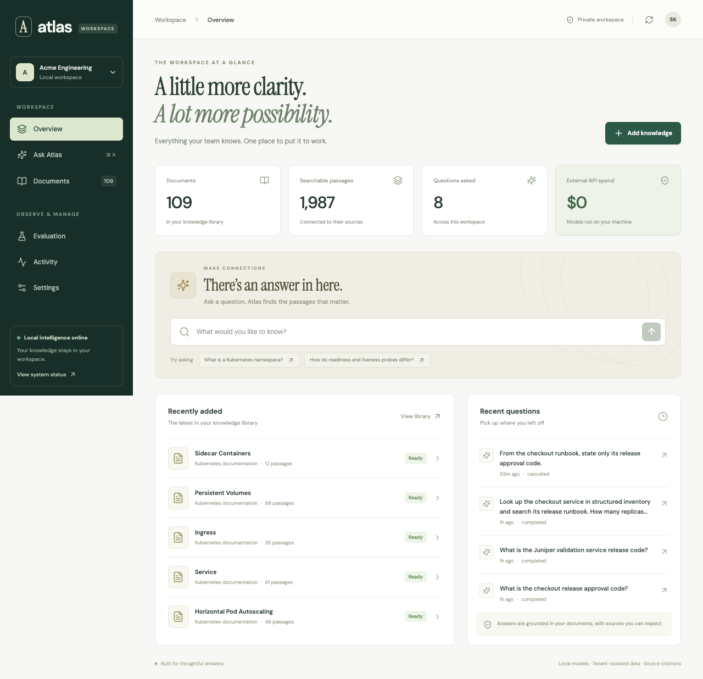
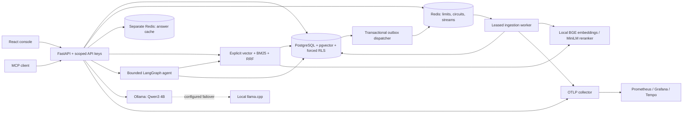

# Atlas — a private knowledge platform

Atlas turns a workspace’s documents and service inventory into searchable, cited answers. It combines explicit hybrid retrieval, a bounded tool-using agent, PostgreSQL tenant isolation, durable background ingestion, and an operational console. Generation, embeddings, reranking, and the optional judge run locally. Paid model APIs are disabled.



## Use the running app

Open **http://127.0.0.1:8100**, then choose **Acme Engineering**. It contains pinned Kubernetes documentation and a clearly marked synthetic team runbook. **Northstar Labs** has separate private demonstration data.

Try:

- “What is the checkout release approval code?”
- “How do readiness and liveness probes differ?”
- In **Agent + tools** mode: “Look up checkout in inventory and search its release runbook. How many replicas does it use, and which team approves releases?”

Upload UTF-8 Markdown or plain text, wait for **ready**, ask a question, and click a citation to inspect its exact passage. The console also provides query history, key management, indexing job status/retry, workspace token budgets, and evaluation-label review.

```sh
make start   # start this project's services
make status
make stop    # gracefully stop native Atlas processes; keep database volumes
```

Logs, process IDs, local keys, and downloaded models stay in ignored directories. The launcher stops only processes whose recorded identity still matches. Existing unrelated Docker services are not managed by this project.

## What is finished, and what still needs a human

All five phases have implementations. Automated tests exercise isolation, indexing, retrieval, streaming, tools/MCP, quota enforcement, retry/failover, cache behavior, worker recovery, and the browser flows. See [TEST_REPORT.md](TEST_REPORT.md) for executed checks and limitations.

**Formal corpus quality acceptance is pending your review of 50 labels.** The original brief explicitly requires the owner to review every label. Generated questions remain `reviewed: false`; neither the code nor this report treats them as ground truth. The evaluation engine refuses to run against unreviewed, changed, or deleted evidence. Synthetic engineering experiments below are a separate test dataset.

Kubernetes resources are deployment templates. A local implementation and smoke test do not establish production readiness or cluster capacity.

## Architecture



### Five phases

| Phase | Implementation | Evidence / qualification |
|---|---|---|
| 1. Foundations | FastAPI, hashed keys, scoped transactions, forced RLS, migrations | Direct SQL tests deliberately omit tenant filters; concurrent HTTP isolation tests |
| 2. Ingestion and RAG | Durable upload, exact source offsets, cached embeddings, HNSW, explicit BM25/RRF, streamed citations | Real embedding/idempotency tests and browser upload → indexing → answer |
| 3. Evaluation | Review UI/file, source/review hashes, metrics, experiments, optional local judge, regression gate | Engine and fixture experiments tested; corpus results gated on your review |
| 4. Agent and MCP | Validated tools, structured inventory, LangGraph limits, malformed-output/error handling, authenticated MCP | Real MCP SDK calls and a real answer combining both evidence types |
| 5. Serving | Atomic limits/reservations, cache, retries/circuits/failover, queue leases/DLQ, telemetry, k6, containers, K8s templates | Actual load measurements and fault/recovery tests; cluster deployment not executed |

## Clean setup

Prerequisites: Python 3.12, `uv`, Node 22+, Docker with a running engine, standalone `docker-compose`, and Ollama. On Apple Silicon, the native model process uses Metal. The reference machine has an Apple M1 Pro and 16 GiB RAM.

```sh
make bootstrap
```

Bootstrap creates private random credentials, installs locked dependencies, starts PostgreSQL/Redis/telemetry, migrates the schema, downloads pinned retrieval models, builds the UI, starts native processes, pulls Qwen, creates two local workspaces, indexes the pinned corpus, and prepares unreviewed labels. First setup needs network access and several gigabytes of disk space. Normal operation does not need paid API credentials.

`uv.lock` and `web/package-lock.json` pin dependencies. Linux images use CPU-only PyTorch wheels; macOS uses its native wheel. Retrieval model revisions and the generation GGUF digest are in [models](models). Corpus paths, hashes, license, and source commit are in [datasets/manifest.json](datasets/manifest.json).

### Portable Docker mode

Stop native API/worker processes before binding the same API port:

```sh
make stop
python3 scripts/configure.py
docker-compose up -d --build
```

Model initialization and the first Qwen pull take time. The API and worker wait for migrations and model setup. Allocate at least 6 GiB to the Docker VM as a starting point for CPU inference; capacity still needs verification. The reference Colima VM has 2 GiB and shares memory with unrelated containers. The image built and passed non-root, health, readiness, static UI, authentication, and host-inference connectivity checks, but its uncached query timed out under resource pressure. **A complete container inference run remains unverified.** The native application is the tested local path. For a larger VM, `OLLAMA_URL_DOCKER=http://host.lima.internal:11435` uses native Metal inference; Docker Desktop uses `host.docker.internal`. `ATLAS_API_PORT=8101` selects another host port.

The container API receives runtime credentials only; the migration service owns admin credentials. Local convenience workspace login is disabled in container/cluster mode. Create a tenant through the administrative CLI, then read its generated key from the private workspace file to sign in. Do not print keys in terminal logs or commit that file.

```sh
docker-compose run --rm --no-deps -v atlas-rag_console_data:/app/.local migrate python -m atlas.cli tenant "My workspace" my-workspace
docker-compose cp api:/app/.local/workspaces.json .local/docker-workspaces.json
chmod 600 .local/docker-workspaces.json
```

For migrations, the `migrate` service already has its database admin URL. The named volume above belongs to Compose project `atlas-rag`. This creates an empty tenant; upload your own documents in the UI.

## Measured local load

Source: [versioned k6 artifacts](artifacts/benchmarks/20260915T163153Z) and [summary](artifacts/benchmarks/latest.json). Workloads ran separately on Apple M1 Pro / 16 GiB / macOS 26.5.2, with PostgreSQL and Redis in Colima and native Ollama Qwen3-4B-Instruct-2507 Q4_K_M. Query workloads lasted 30 seconds, after warmup. The query asks for a short, known release code; these figures do not represent long-answer throughput.

| Workload | Completed requests | Actual req/s | p50 | p95 | p99 | HTTP / answer error rate |
|---|---:|---:|---:|---:|---:|---:|
| Exact cached answer | 553 | 18.43 | 52.26 ms | 504.26 ms | 1,152.35 ms | 0% / 0% |
| Uncached local generation | 29 | 0.93 | 892.57 ms | 2,222.52 ms | 2,392.35 ms | 0% / 0% |
| Upload acceptance only | 40 | 11.65 | 95.37 ms | 440.34 ms | 1,098.75 ms | 0% / N/A |

The cached workload offered 20 requests/s and **dropped 47 scheduled iterations** after reaching its 8-virtual-user limit. It did not sustain the complete offered load. Cache hit rate was 100% for this deliberately warmed, repeated-question workload and 0% for explicitly uncached requests; this is not an organic usage hit-rate estimate.

**Completed indexing:** 40 unique documents → 80 chunks in 58.11 seconds, or **41.30 documents/minute**. This includes HTTP submission, queue wait, embedding, and database publication, with an initially empty tenant embedding cache. Upload acceptance latency is reported separately and is not indexing completion latency.

**Actual external model API cost:** $0 per request and $0 for the run. This excludes hardware, electricity, and operator time. The usage ledger recorded 22,560 input tokens and 480 output tokens across query traffic including warmup. Cached responses invoke no generation model. No dollar savings are claimed against a paid provider that was never used.

Reproduce with `make benchmark`. It creates disposable workspaces, provisions explicit benchmark quotas, copies the corpus, runs separate workloads, waits for indexing completion, records raw k6 output, and deletes its test tenants. Default workspace limits remain 60 expensive requests/minute and 1,000,000 monthly generation tokens.

## Retrieval and evaluation

### Retrieval design

- Recursive character splitting starts at 1,000 characters with 120-character overlap. Each final chunk also fits the embedding model's token limit. Source offsets refer to the original stored text.
- BGE-small-en-v1.5 produces normalized 384-dimensional embeddings. Query instructions follow the model's retrieval convention. Embedding cache keys include tenant, content hash, and model/encoding revision.
- HNSW cosine search and explicit BM25 each return candidates. BM25 uses `k1=1.2`, `b=0.75`; corpus size, document frequency, and average length are calculated inside the same tenant/collection snapshot.
- Reciprocal-rank fusion is `sum(weight / (60 + rank))`. The constant and lexical/vector weights are configurable. This avoids mixing incomparable raw BM25 and cosine scales.
- MiniLM cross-encoder reranking is optional. HNSW trades index build time and memory for good approximate-query behavior without an IVFFlat training step. Tenant filtering still applies, with pgvector iterative scanning enabled.
- The initial cosine relevance floor is **0.48, an uncalibrated default**, not an asserted accuracy guarantee. Empty/weak evidence abstains. Citation-marker validation checks source references, not factual truth.
- The generation prompt treats retrieved text as untrusted evidence. It separates instructions from JSON evidence, bounds input/output, and requires citations. Prompt separation reduces exposure; it does not prove that prompt injection is impossible.

### Executed synthetic engineering experiments

[Raw per-query results](artifacts/engineering-experiments.json). These use **12 programmatically authored synthetic service fixtures**, with known evidence spans. They exercise the experiment machinery and exact-identifier retrieval. They are not the required human-reviewed Kubernetes evaluation and should not be presented as general corpus quality on a resume.

| Chunk size | Retrieval | Rerank | k | Recall@k | MRR | nDCG@k | Mean retrieval time |
|---:|---|---|---:|---:|---:|---:|---:|
| 600 | Hybrid | No | 5 | 1.0000 | 1.0000 | 1.0000 | 43.97 ms |
| 1,000 | Hybrid | No | 5 | 1.0000 | 1.0000 | 1.0000 | 53.03 ms |
| 1,400 | Hybrid | No | 5 | 1.0000 | 1.0000 | 1.0000 | 38.51 ms |
| 1,000 | Vector | No | 5 | 0.7917 | 1.0000 | 0.8197 | 37.76 ms |
| 1,000 | Hybrid | Yes | 5 | 0.5000 | 1.0000 | 0.6131 | 363.27 ms |
| 1,000 | Hybrid | No | 3 | 1.0000 | 1.0000 | 1.0000 | 54.35 ms |
| 1,000 | Hybrid | No | 8 | 1.0000 | 1.0000 | 1.0000 | 52.49 ms |

A gold span may overlap multiple chunks, so full chunk recall is stricter than finding any passage sufficient to answer. The reranker found a relevant first result but omitted other overlapping gold chunks. Its first measured run also includes model loading. These limitations matter when interpreting the table.

### Your review workflow

1. Open **Evaluation**. Review each question and the supporting source. You can edit the question and evidence offsets and expand the full source.
2. Check the confirmation box only after verifying the label. All 50 current candidates must be reviewed; changed source/question/span hashes invalidate approval.
3. Run `make eval`, or use the UI for the development split.
4. Run `make experiments` for three chunk sizes, vector vs hybrid, reranking, and three top-k values. Fix overlap while sweeping size. Use the development split for selection, then a fixed configuration on held-out labels.
5. Optional: `.venv/bin/python scripts/evaluate.py --judge` generates answers and invokes the reviewable [faithfulness prompt](prompts/faithfulness.md). Judge output is an **uncalibrated local proxy**. The same model family judges and generates, so independent human calibration is still needed.
6. Accept a measured development baseline in [datasets/baseline.json](datasets/baseline.json), including its source run. `--gate` then fails below it. Export the reviewed labels with `scripts/prepare_labels.py` and commit that export with the accepted baseline to enable the dedicated CI quality workflow. It rebinds existing reviews only to byte-identical source text. The gate's rejection behavior is tested with deliberately degraded synthetic rankings; no corpus threshold has been invented.

[labels.review.jsonl](datasets/labels.review.jsonl) is the reviewable export. `scripts/prepare_labels.py` refreshes it from the database without granting approval. Runs record configurations, model/label hashes, per-query expected/retrieved IDs, and aggregate metrics. Formal corpus results for all four sweeps are **TBD — pending human label review**.

## Serving guarantees and limits

- **Two isolation layers:** application predicates plus forced PostgreSQL RLS. Runtime roles are non-superuser and cannot bypass RLS. Transaction-local tenant context resets with the transaction. Composite foreign keys prevent cross-tenant references.
- API keys are random and stored as digests. Scopes, revocation, expiry, HTTP-only cookies, same-origin mutation checks, and source ownership checks are enforced. Convenience login is restricted to loopback host/peer checks.
- Redis Lua applies an atomic sliding window using Redis time. Rate state and the queue use durable `noeviction` Redis. Optional cache data uses a separate bounded `allkeys-lru` Redis.
- Monthly tokens are reserved before inference and settled idempotently from observed usage. Ambiguous cancellation/failure retains the reservation instead of inventing usage. Local USD spend remains zero; paid-provider configuration is rejected at startup.
- Exact answer caching is enabled. Semantic reuse is implemented but **disabled by default until its threshold is calibrated**. Cache namespaces include tenant, scopes, collection revision, retrieval settings, model, and prompt revision. Ingestion/deletion advances collection revisions. Cache failure is a miss; unavailable rate enforcement fails closed.
- The outbox and document/job creation commit together. The worker publishes events, claims leases, renews them, and idempotently publishes chunks. Expired leases can be reclaimed. Retries back off; exhausted jobs enter the dead-letter stream and may be retried in Settings. Deleting a document during indexing cannot resurrect it.
- Generation uses bounded admission, deadlines, transient retries, `Retry-After`, and Redis-backed open/half-open circuits. No retry occurs after response text has streamed. Optional llama.cpp fallback must be running and explicitly enabled; it was exercised with a forced unavailable primary in [the real failover run](artifacts/failover-smoke.json).
- Agent calls have step/time/error limits, validated tool inputs/outputs, and duplicate-call detection. It can gracefully answer from available evidence when a limit is reached. See [the real combined-evidence run](artifacts/agent-smoke.json).

## MCP and observability

MCP endpoint: `http://127.0.0.1:8100/mcp/`, using a scoped Bearer API key. It exposes `search_documents`, `query_structured_data`, and `compare_items`. `scripts/mcp_smoke.py` uses the actual MCP client SDK to initialize, list, and call tools across both tenants. [Recorded result](artifacts/mcp-smoke.json).

The native launcher enables OTLP export. Metrics are exposed by the collector at `http://127.0.0.1:59464/metrics`. Pipeline/agent spans contain request and tenant IDs, stage timing, observed token counts, cache state, and zero actual API cost. Prompts, document bodies, and credentials are excluded from telemetry.

```sh
make observability
```

Optional Grafana: `http://127.0.0.1:53000`; dashboard [JSON](infra/grafana/atlas.json). The overlay adds Prometheus and Tempo. Native core operation does not require those heavier services. Collector file export is bounded and stored privately under `.local/telemetry`; durable trace retention requires the observability stack or another configured OTLP backend.

## Verification and repository map

```sh
make check       # Ruff, format, mypy, production UI build
make test        # PostgreSQL/Redis tests plus the local-model integration test
make e2e         # real browser; requires Chrome and running native services
make benchmark   # separate measured workloads
```

| Path | Purpose |
|---|---|
| `src/atlas/api.py` | Upload, query/SSE, source access, keys, budgets, jobs |
| `ingestion.py`, `chunking.py`, `embedding.py` | Versioned idempotent indexing and exact spans |
| `retrieval.py` | Readable vector, BM25, fusion, and reranking |
| `evaluation.py`, `judge.py`, `prompts/` | Review gate, metrics, comparisons, judge proxy |
| `agent.py`, `tools.py`, `mcp_server.py` | Bounded orchestration and scoped tools |
| `serving.py`, `generation.py`, `worker.py` | Quotas, cache, resilience, durable processing |
| `migrations/` | Tenant schema, roles, indexes, RLS, outbox |
| `web/` | Responsive React console and Playwright journeys |
| `benchmarks/`, `artifacts/` | Workload definitions and executed evidence |
| `infra/` | Collector, dashboards, optional observability, K8s templates |

The GitHub Actions workflow runs lint/type checks, migrations, non-model tests, and the frontend build. It reports the pending quality gate explicitly. A remote CI run is not claimed without a configured remote repository.

## Trade-offs and next steps

The platform favors explicit SQL and small modules over retrieval frameworks. LangGraph is used only for agent control flow. On this laptop, a single generation slot and a single indexing worker keep memory use predictable; they also cap throughput. BM25 statistics are computed at query time to avoid stale cross-tenant aggregates, at the cost of extra SQL work. At substantially greater load, precompute versioned collection statistics, partition large tenants, batch inference behind a dedicated service, scale workers independently, and test backup/restore and sustained mixed workloads.

Next: complete human label review, calibrate relevance and semantic-cache thresholds, independently calibrate the judge, run longer realistic multi-question loads, and deploy/validate the Kubernetes template against the chosen cluster. Those are acceptance steps, not results inferred from a local demo.
